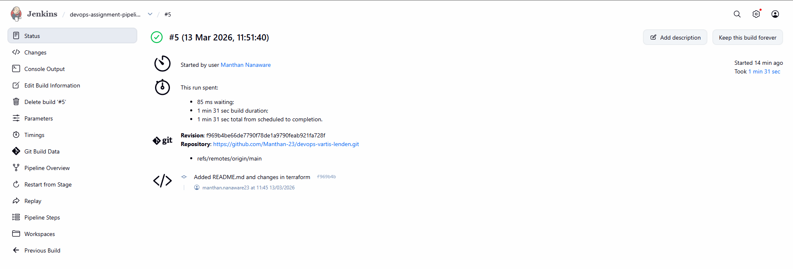
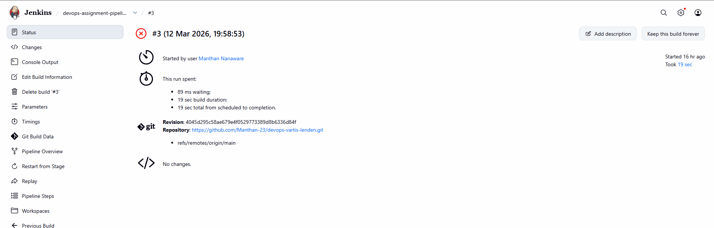
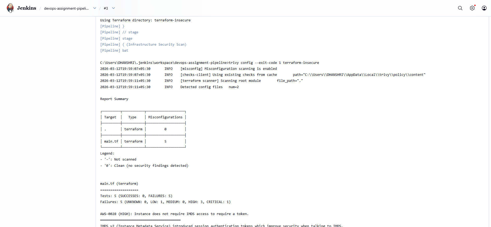
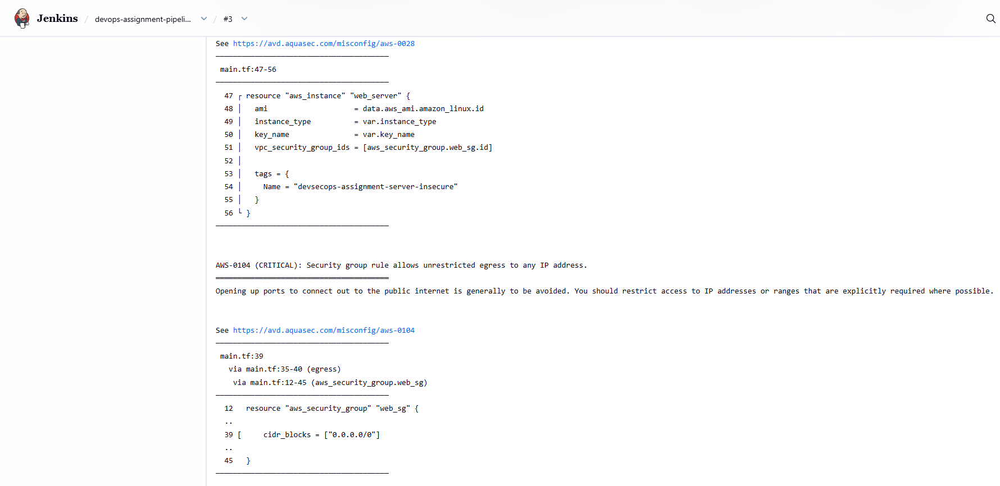
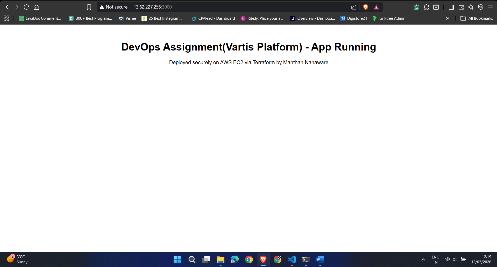
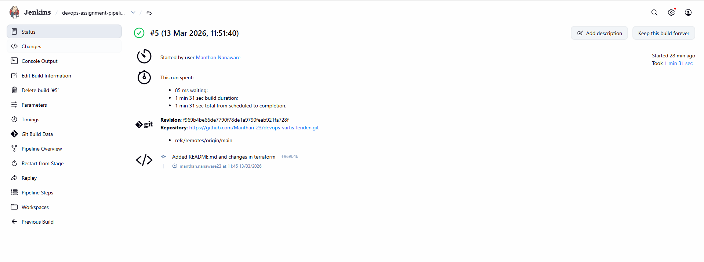
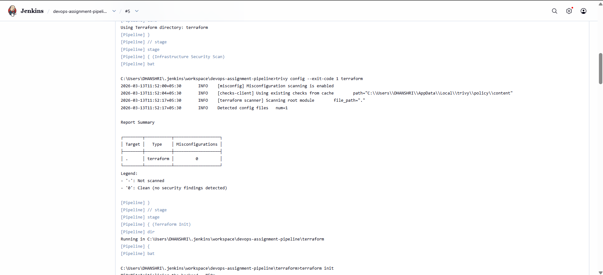
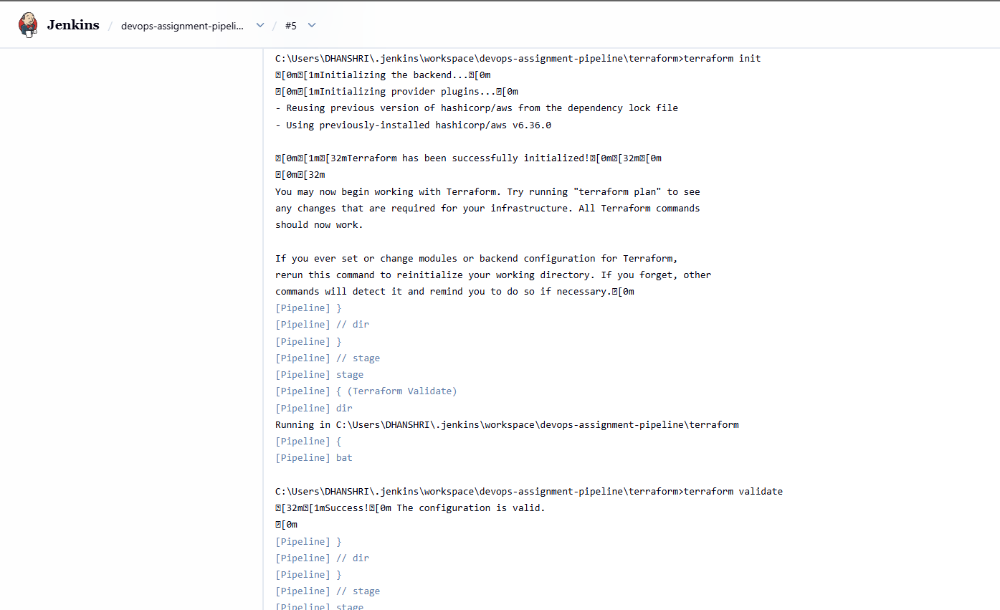
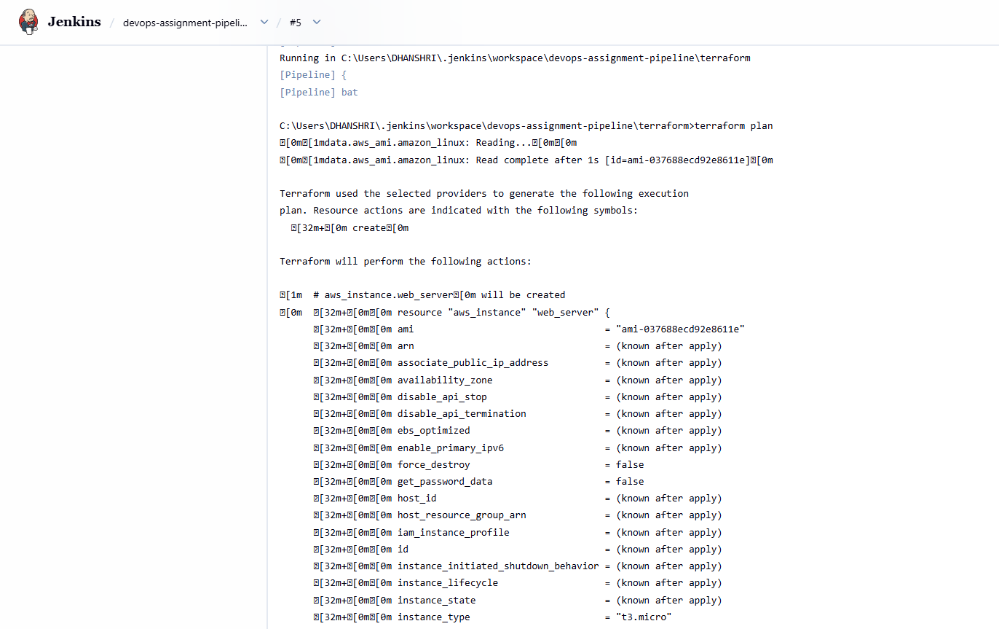

# DevOps Assignment – GET 2026  
**Vartis Platform (LenDenClub) – DevOps Engineer Assignment**

## Video Link
**Video Recording (5–10 minutes):**  
[Watch the demo video](https://drive.google.com/file/d/17fSz2PakT6STb6waMBTdhYxLxiiZrvSh/view?usp=sharing) 

> **Cleanup Note:** After completing the demonstration, the AWS resources provisioned for this assignment were destroyed using `terraform destroy` to avoid unnecessary cloud costs.

## Project Overview
This project demonstrates a complete **DevSecOps workflow** for securely provisioning and validating cloud infrastructure before deployment.

The objective of this assignment was to:

- Provision cloud infrastructure for a web application using **Terraform**
- Build a **Jenkins pipeline** that automatically scans Terraform code for security misconfigurations before deployment
- Use **AI (GenAI)** to analyze the security report, explain the risks, and remediate the Terraform code
- Deploy the final secured infrastructure to **AWS EC2**
- Verify that the application is accessible through the **cloud public IP**

This project follows a **secure-by-default** approach and demonstrates both the **insecure initial state** and the **final remediated secure state**.

---

## Repository Structure

```bash
devops-lenden/
│
├── app/                        # Simple web application source code
│   ├── server.js
│   └── package.json
│
├── Dockerfile                  # Docker build file for application
├── docker-compose.yml          # Local Docker compose setup
│
├── terraform/                  # Final SECURE Terraform version
│   ├── provider.tf
│   ├── variables.tf
│   ├── main.tf
│   └── outputs.tf
│
├── terraform-insecure/         # Initial INSECURE Terraform version (for failing scan demo)
│   ├── provider.tf
│   ├── variables.tf
│   ├── main.tf
│   └── outputs.tf
│
├── Jenkinsfile                 # Jenkins pipeline definition
└── README.md                   # Project documentation + GenAI usage report
```

---

## Architecture Overview

### DevSecOps Workflow

```text
GitHub Repository
        │
        ▼
     Jenkins Pipeline
        │
        ├── Checkout Code
        ├── Trivy Security Scan
        ├── Terraform Init
        ├── Terraform Validate
        └── Terraform Plan
                │
                ▼
           AWS Infrastructure
                │
                ▼
          EC2 Instance (Secure)
                │
                ▼
     Application Bootstrapped via User Data
                │
                ▼
      Accessible on Public IP:3000
```

---

## Cloud Provider Used
- **Amazon Web Services (AWS)**

### AWS Services Used
- **EC2** – Virtual machine / compute instance
- **Security Group** – Networking and security configuration
- **EBS (Root Volume)** – Encrypted storage for EC2 root disk

### AWS Region Used
- **eu-north-1**

---

## Tools & Technologies Used

### Infrastructure / DevOps
- **Terraform**
- **Jenkins**
- **Trivy**
- **AWS CLI**

### Cloud
- **AWS EC2**
- **AWS Security Groups**

### Application
- **Python** (deployed via EC2 user data for final cloud demo)
- **Node.js application files included** (`app/`, `Dockerfile`, `docker-compose.yml`) for the containerization requirement

### AI / Security Remediation
- **ChatGPT (GenAI)** for:
  - security issue explanation
  - risk analysis
  - Terraform remediation recommendations

---

## Assignment Requirements Mapping

### 1. Web Application & Docker
- Included:
  - `app/`
  - `Dockerfile`
  - `docker-compose.yml`

> **Note:** During local development, Docker Hub image pulls were blocked due to environment/network connectivity restrictions, which prevented reliable local Docker-based execution. To ensure timely completion of the assignment, I used a secure EC2 bootstrap approach via Terraform `user_data` for the final cloud deployment and ran Jenkins locally without Docker. The repository still includes the required Docker artifacts (`Dockerfile`, `docker-compose.yml`, and application source code), and the core DevOps workflow requirements—pipeline automation, security scanning, AI-assisted remediation, and cloud deployment were fully completed and demonstrated.


### 2. Infrastructure as Code (Terraform)
- Provisioned AWS infrastructure using Terraform
- Includes:
  - EC2 instance
  - Security group
  - Secure networking configuration

### 3. Intentional Vulnerability
- Created a separate **insecure Terraform version** in:
  - `terraform-insecure/`

This version intentionally included:
- SSH open to `0.0.0.0/0`
- Unrestricted outbound traffic
- No IMDSv2 enforcement
- No root volume encryption

### 4. CI/CD Pipeline (Jenkins)
- Jenkins pipeline pulls code from GitHub
- Runs Trivy security scan
- Fails on insecure Terraform
- Passes on final secure Terraform
- Runs:
  - `terraform init`
  - `terraform validate`
  - `terraform plan`

### 5. AI-Driven Security Remediation
- Trivy findings were analyzed using GenAI
- AI was used to:
  - summarize risks
  - explain impact
  - rewrite Terraform securely

### 6. Cloud Deployment
- Final secure Terraform was deployed to AWS
- Application is accessible on the cloud public IP

---

## GenAI Usage Report (Mandatory)

### Exact AI Prompt Used

```text
I ran a Trivy misconfiguration scan on my Terraform infrastructure for an AWS EC2 deployment.

Here is the Trivy report:

[pasted Trivy output]

Please do the following:
1. Summarize each security issue in simple DevOps terms.
2. Explain the risks of each issue.
3. Rewrite the Terraform code to remediate all findings.
4. Ensure the infrastructure remains functional for hosting a web application on port 3000.
5. Keep the code production-aware and security-focused.
```

---

### AI Summary of Identified Risks

The AI identified the following security risks:

1. **Public SSH Exposure**
   - Port 22 was open to `0.0.0.0/0`
   - This allowed unrestricted internet access to the server’s management interface

2. **Unrestricted Egress**
   - The security group allowed unrestricted outbound traffic
   - This increased the risk of data exfiltration and malicious outbound communication if the host was compromised

3. **IMDSv2 Not Enforced**
   - The EC2 instance did not require metadata tokens
   - This increased exposure to metadata service abuse / credential theft risks

4. **Unencrypted Root Volume**
   - The EC2 root disk was not explicitly encrypted
   - This weakened data-at-rest protection

5. **Poor Rule Auditability**
   - Security group rules lacked proper descriptions in the initial version

---

### AI-Recommended Remediation Actions

The AI recommended:

- Removing public SSH access entirely
- Keeping only application port **3000** publicly accessible
- Enforcing **IMDSv2**
- Enabling **root block device encryption**
- Using secure bootstrap automation via **EC2 user data**
- Hardening the Terraform configuration while preserving application availability

---

### How AI Improved Security

The final secure Terraform version improved the infrastructure by:

- Eliminating public administrative access
- Reducing exposed attack surface
- Enforcing modern EC2 metadata security controls
- Protecting data at rest
- Preserving application access on port **3000**
- Enabling a **secure-by-default** deployment model

---

## Jenkins Pipeline Overview

The Jenkins pipeline supports two Terraform targets:

- **`terraform-insecure`** → demonstrates failing security scan
- **`terraform`** → demonstrates final secure passing scan

### Pipeline Stages
1. **Checkout**
2. **Infrastructure Security Scan (Trivy)**
3. **Terraform Init** *(secure version only)*
4. **Terraform Validate** *(secure version only)*
5. **Terraform Plan** *(secure version only)*

### Pipeline Logic
- If `terraform-insecure` is selected:
  - Trivy detects misconfigurations
  - Pipeline fails intentionally

- If `terraform` is selected:
  - Trivy passes with zero misconfigurations
  - Terraform init / validate / plan complete successfully

---

## Security Scanning with Trivy

### Initial Security Scan (Insecure Terraform)
The initial `terraform-insecure/` configuration was intentionally vulnerable.

### Initial Trivy Findings
The initial scan detected the following misconfigurations:

- **AWS-0028 (HIGH)** – IMDSv2 not enforced
- **AWS-0104 (CRITICAL)** – Unrestricted egress to any IP
- **AWS-0107 (HIGH)** – SSH open to the public internet
- **AWS-0124 (LOW)** – Missing security group rule description
- **AWS-0131 (HIGH)** – Root block device not encrypted

### Initial Summary
- **1 Critical**
- **3 High**
- **1 Low**

This confirmed that the pipeline correctly detected insecure infrastructure before deployment.

---

## Before & After Security Report

### Before Remediation
- Trivy detected **5 misconfigurations**
- Severity:
  - **1 Critical**
  - **3 High**
  - **1 Low**

### After Remediation
- Final Trivy scan result:

```text
Misconfigurations = 0
```

### Security Improvements Applied
- Removed public SSH exposure
- Removed unrestricted outbound rules from Terraform code
- Enforced **IMDSv2**
- Enabled **root volume encryption**
- Added security-focused instance configuration
- Preserved public access only for the application on **port 3000**

---

## Final Secure Terraform Highlights

The final `terraform/` directory includes the secured version with:

- Only **port 3000** exposed publicly
- **IMDSv2 enforced**
- **Encrypted root volume**
- **User data** used for automated application bootstrap
- `user_data_replace_on_change = true` for reliable immutable-style updates

### Important Security Controls Implemented
- `metadata_options { http_tokens = "required" }`
- `root_block_device { encrypted = true }`
- No public SSH ingress
- Minimal public exposure limited to the application

---

## Cloud Deployment

The final secure Terraform configuration was applied to AWS and successfully provisioned:

- 1 EC2 instance
- 1 security group
- Secure application bootstrap via `user_data`

### Application Access
The application is accessible on the EC2 public IP:

```text
http://13.62.227.255:3000/
```

---


### Video Includes
- Repository overview
- Insecure Terraform configuration
- Failed Jenkins pipeline execution (`terraform-insecure`)
- Security vulnerability report
- AI remediation explanation
- Final secure Terraform configuration
- Successful Jenkins pipeline execution (`terraform`)
- Terraform deployment
- Application running on the AWS public IP

---

## Required Screenshots

### 1. Jenkins Pipeline Success


---

### 2. Security Vulnerability Report




---

### 3. Application Running on Cloud Public IP


---

### 4. Jenkins and Trivy successful scan





---

## Commands Used

### Local Trivy Scan
```bash
trivy config terraform-insecure/
trivy config terraform/
```

### Terraform Validation / Plan
```bash
cd terraform
terraform init
terraform validate
terraform plan
terraform apply
```

### Force Immutable Rebuild (used when updating user_data)
```bash
terraform apply -replace="aws_instance.web_server"
```

---

## Key Learning / DevOps Observations

### 1. Shift-Left Security
Security issues were detected **before deployment** using Trivy integrated into the CI pipeline.

### 2. Secure-by-Default Infrastructure
The final infrastructure intentionally minimized exposure and enforced secure AWS defaults.

### 3. AI-Assisted Remediation
AI accelerated:
- understanding the findings
- prioritizing risks
- rewriting Terraform securely

### 4. Immutable-Style Update Handling
EC2 `user_data` executes only during first boot.  
To support reliable updates, the final infrastructure used:

```hcl
user_data_replace_on_change = true
```

This ensures that bootstrap script changes trigger safe instance replacement.

---

## GitHub Repository Link
[Repository Link](https://github.com/Manthan-23/devops-vartis-lenden)

---

## Final Note
This project demonstrates a practical **DevOps workflow** where insecure infrastructure is detected early, analyzed with AI assistance, remediated securely, and deployed to AWS in a production-aware manner.
